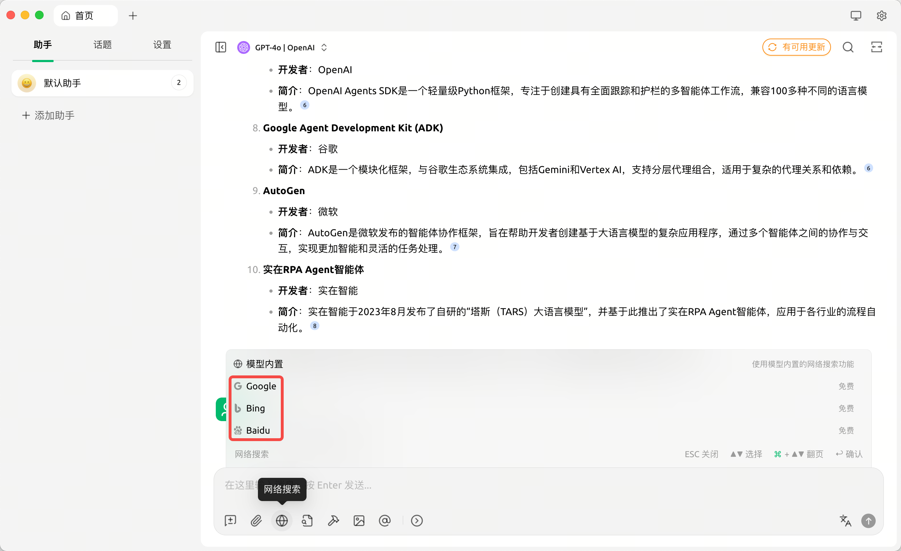
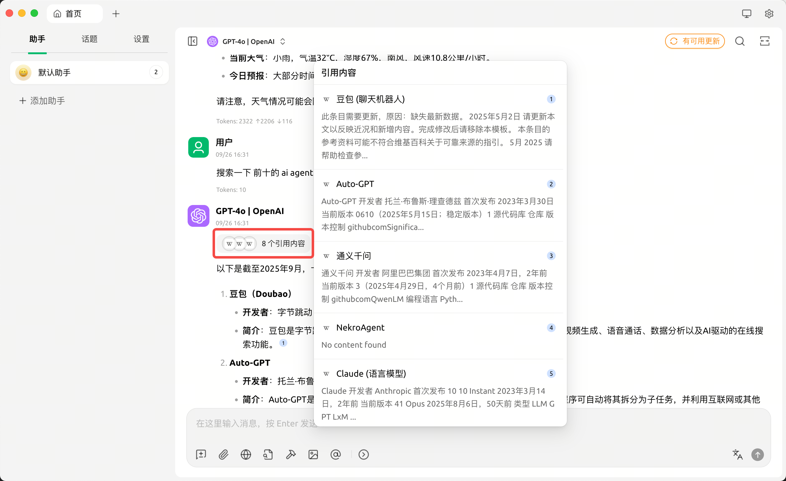
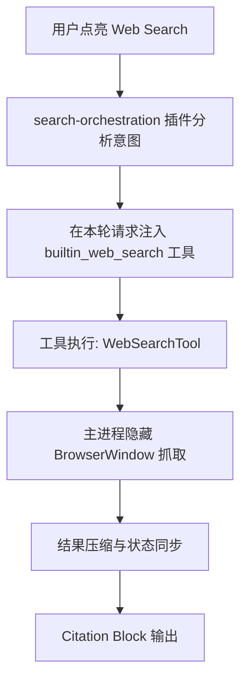

## 概览
[cherry-studio官网](https://www.cherry-ai.com/)

最近在做 agent 的，在调研 web search 的功能的时候。发现 cherry-studio 有免费的网络搜索功能，因为一般 agent 的网络搜索一般需要用第三方的搜索 api。想看看他们是怎么实现的。

  
  

一句话总结:Cherry-Studio 本身是一个 web 应用，网络搜索会在后台打开浏览器去访问 google/bing/baidu 搜索关键词。然后逐个打开前 n 个搜索结果。提取压缩内容后，交给 llm。

具体源码分析在下面

## 流程速览

Cherry Studio 的 Web Search 并非一次简单的 API 调用，而是跨越前端、渲染进程和主进程的一条流水线。下面把这条链路拆开，方便在调试或扩展搜索 provider 时快速定位。

每个阶段都依靠 `requestId` 传递上下文，确保同一轮对话可能触发的多次搜索可以并发执行且状态可追踪。

### 1. 触发开关

- 输入框右侧的地球按钮由 `WebSearchButton` 控制，点击后把选定 provider 写入助手配置，并把 `assistant.enableBuiltinSearch` 标记为 `false`，对应 `src/renderer/src/pages/home/Inputbar/WebSearchButton.tsx:75`。
- Redux 中的 assistant 状态此时带有 `webSearchProviderId`，后续流水线都以它作为搜索渠道依据。

### 2. 意图分析

- 搜索编排插件 `search-orchestration` 被注册为强制最先执行的插件，入口位于 `src/renderer/src/aiCore/plugins/searchOrchestrationPlugin.ts:243`。
- 在 `onRequestStart` 钩子里，插件检测 `assistant.webSearchProviderId` 是否存在，若存在则调用 `analyzeSearchIntent`，把用户最新一句消息和上一轮回复交给模型判断“是否要搜”“搜索哪些关键词”“是否需要附带摘要链接”。实现见 `.../searchOrchestrationPlugin.ts:249` 与 `:72`。
- 分析结果会缓存到 `intentAnalysisResults[requestId]` 中，并记录原始用户输入供知识库或记忆工具复用。

### 3. 工具注入

- `transformParams` 钩子在生成最终请求参数前再次被触发，如果缓存里判定需要外部搜索，就把 `builtin_web_search` 加入本次 AI 请求的工具列表，参见 `.../searchOrchestrationPlugin.ts:315`。
- 注入同时携带：当前 provider、模型给出的搜索关键词或链接、`requestId`，用于后续状态追踪。

### 4. 工具执行

- 当模型决定调用 `builtin_web_search` 时，会执行 `webSearchToolWithPreExtractedKeywords.execute`（`src/renderer/src/aiCore/tools/WebSearchTool.ts:42`）。
- 工具把上下文和候选关键词整理成 `ExtractResults` 结构，然后调用核心服务 `WebSearchService.processWebsearch`，把 `requestId` 继续向下传递。

### 5. 主进程抓取

- `processWebsearch` 先通过 `setWebSearchStatus` 把 UI 状态重置为 `default`，随后委托 `WebSearchEngineProvider` 选择 provider 的 `search` 方法，入口在 `src/renderer/src/services/WebSearchService.ts:166`。
- 本地 Google/Bing/百度等 provider 由 `LocalSearchProvider.search` 实现（`.../LocalSearchProvider.ts:27`）：
  - 拼接查询 URL，附加语言、日期等修饰符；
  - 通过 `window.api.searchService.openUrlInSearchWindow` 把 URL 发送给主进程；
  - 等待 Promise 返回完整 HTML，再用 provider 子类的 DOM 选择器解析结果链接；
  - 并发抓取各链接正文（可能再次走主进程或直接 `fetch`），并用 Readability/Turndown 转为 Markdown。
- 主进程 `SearchService` 负责“隐形浏览器”：`createNewSearchWindow` 新建隐藏 `BrowserWindow` 并伪装 UA；`openUrlInSearchWindow` 复用窗口加载页面、监听 `did-finish-load`，最后执行 `document.documentElement.outerHTML` 获取 HTML（`src/main/services/SearchService.ts:21`）。
- 抓取收尾后，工具的 `finally` 会调用 `window.api.searchService.closeSearchWindow(uid)` 释放隐藏窗口，避免资源泄漏。

### 6. 结果压缩与状态同步

- `processWebsearch` 汇总成功结果到 `finalResults`，失败则抛出异常交给上层处理。
- 若配置了截断或 RAG 压缩（`websearch.compressionConfig`），会在 `src/renderer/src/services/WebSearchService.ts:437` 起裁剪文本，并持续更新 UI 状态（阶段值如 `rag`、`cutoff` 等）。
- 最终返回 `WebSearchProviderResponse`，包含 `query` 及 `results` 列表。

### 7. Citation Block 呈现

- 工具完成后，流式回调 `toolCallbacks.onToolCallComplete` 把 `toolResponse.response` 填回消息块。
- 对于 `builtin_web_search`，系统会自动创建 Citation Block，把搜索到的 URL、标题、摘要组织成引用列表，参见 `src/renderer/src/services/messageStreaming/callbacks/toolCallbacks.ts:87`。
- 对话面板最终展示的 “参考链接 [1][2] …” 即由该 Citation Block 渲染而来。

## 隐形浏览器的意义

隐藏的 `BrowserWindow` 能加载 Google/Bing/百度等未开放 API 的真实页面，从而让渲染进程拿到完整 HTML。前端再借助 DOM 解析与 Markdown 转换完成信息抽取，并在回复里引用。整个链路依靠 `requestId` 贯穿：

- 多条搜索请求可并发但互不干扰；
- UI 能实时显示“正在抓取”“压缩失败”等状态；
- Citation Block 能在第一时间匹配结果来源。

开启 Web Search 后，每条消息都会自动经历：意图分析 → 工具注入 → 工具执行 → 主进程抓取 → 结果压缩 → Citation 呈现。真正访问外部网页的，正是那扇主进程里永远不见光的隐藏浏览器窗口。
