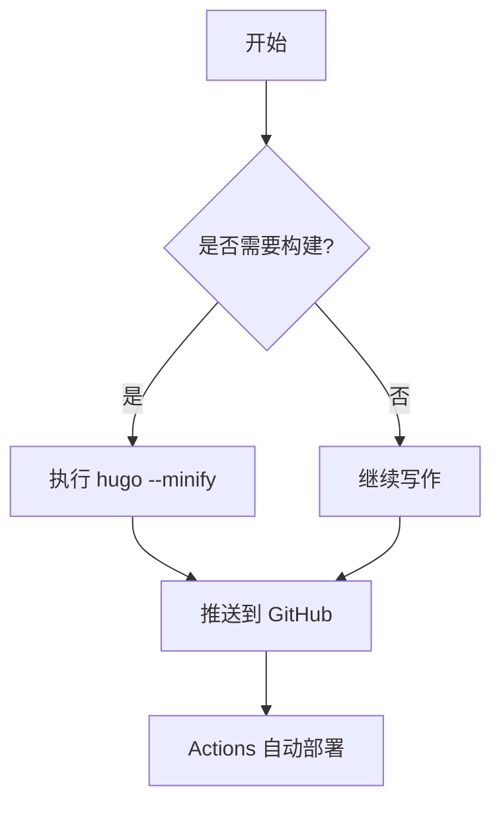

> 这是一篇演示文章，用来快速验证主题对各种 Markdown 语法的兼容性。

## 标题与文本排版

### 文本强调

普通段落可以包含 **加粗**、*斜体*、`行内代码` 以及~~删除线~~。你也可以插入脚注[^footnote] 来补充额外说明。

### 列表

- 无序列表项一
- 无序列表项二
  - 嵌套列表
- 无序列表项三

1. 有序列表第一步
2. 有序列表第二步
3. 有序列表第三步

### 提示块示例

> **Tip:** 在 Hugo 中可以使用短代码或自定义组件进一步增强样式。

## 表格与代码

| 名称 | 描述 | 备注 |
| ---- | ---- | ---- |
| Hugo | 快速的静态站点生成器 | 使用 Go 编写 |
| GitHub Actions | 持续集成平台 | 免费托管公开仓库 |
| Markdown | 轻量级标记语言 | 和 IDE 配合良好 |

```bash
# 执行 hugo 本地构建
hugo server --buildDrafts
```

```go
package main

import "fmt"

func main() {
    fmt.Println("Hello Markdown Showcase")
}
```

```json
{
  "name": "notes",
  "version": "1.0.0",
  "scripts": {
    "build": "hugo"
  }
}
```

## 图片与链接


- 站内链接示例：[第一篇文章](/posts/hello-world/)
- 站外链接示例：[Hugo 官方文档](https://gohugo.io/)

## 代码块高亮

```python
from pathlib import Path

posts = sorted(Path("content/posts").glob("*.md"))
for post in posts:
    print(post.name)
```

## 数学公式

行内表达式示例：$E=mc^2$。

块级公式示例：

$$
\int_{a}^{b} f(x) \, dx = F(b) - F(a)
$$

## Mermaid 流程图



## 代码 diff

```diff
- baseURL = "https://example.com"
+ baseURL = "https://si40code.github.io/notes/"
```

## 任务清单

- [x] 准备新主题
- [x] 配置 GitHub Actions
- [ ] 撰写更多文章

## 定义列表

Hugo
: 使用 Go 构建的静态网站生成器。

GitHub Pages
: GitHub 提供的静态站点托管服务，适合博客或项目文档。

## 结束语

以上示例涵盖了常见的 Markdown 写法。可以根据页面渲染效果进一步调整主题样式，让每种内容都具备清晰的可读性。

[^footnote]: 脚注示例，这里可以放一些补充说明。
