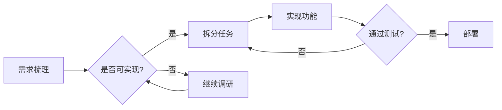
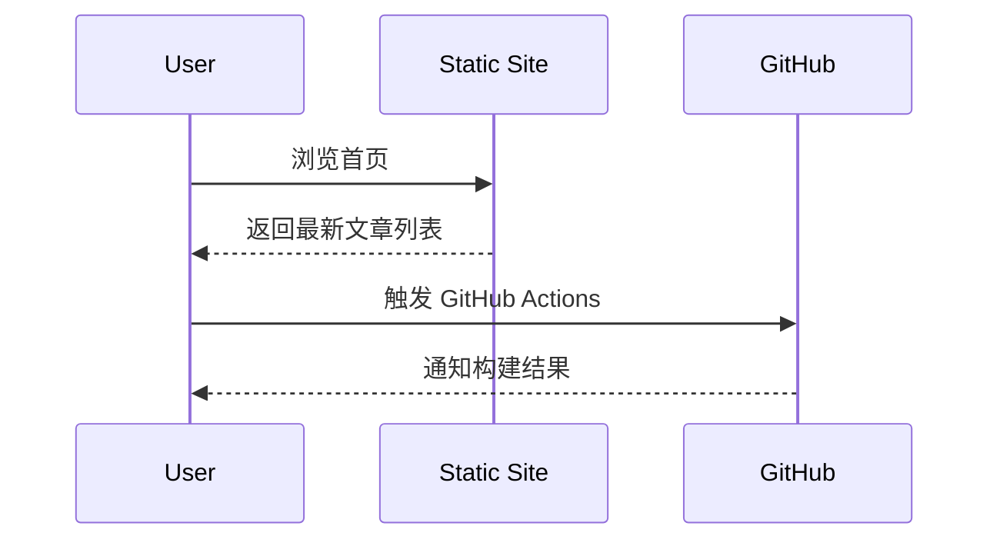
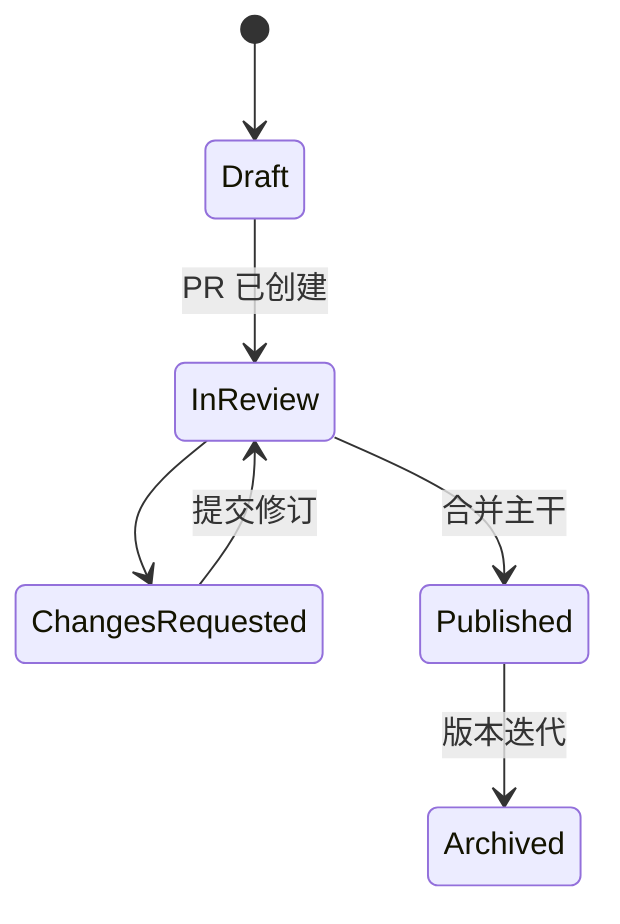
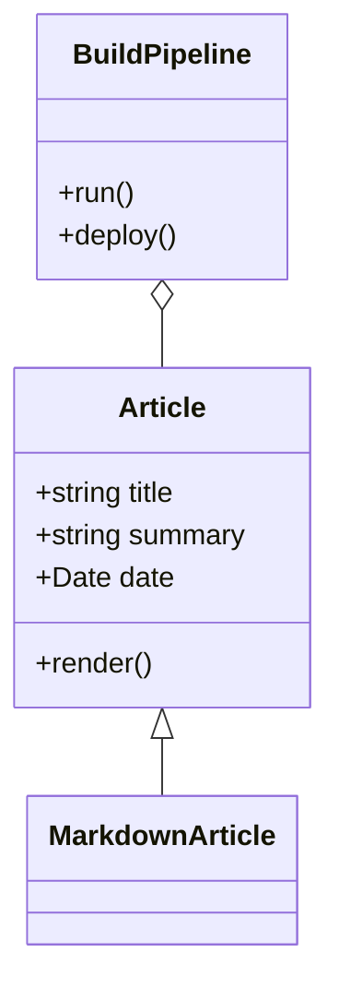
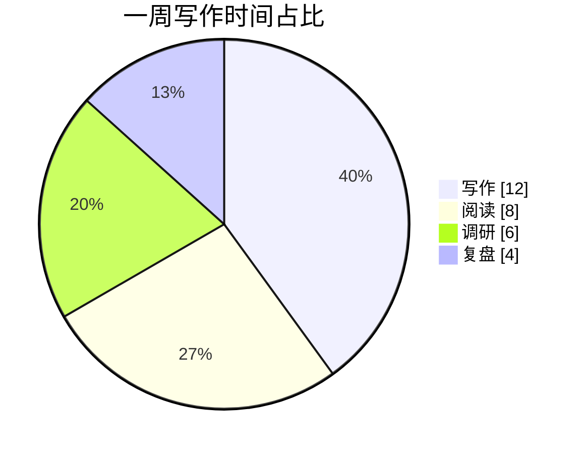
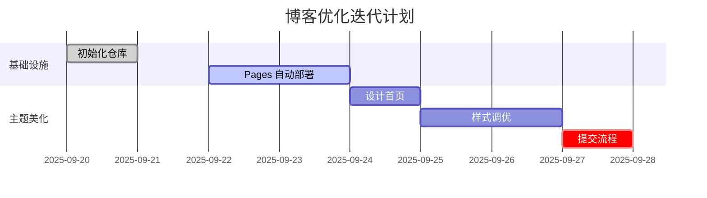
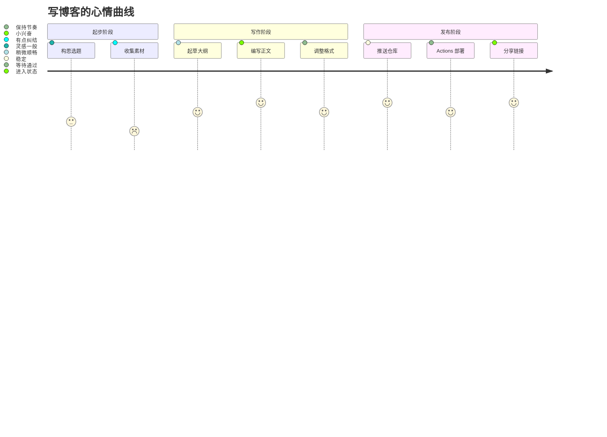

Mermaid 支持多种图形语言，这篇文章快速罗列我最常用的几种类型，方便检查主题对代码块的渲染表现。

## 流程图 (Flowchart)

## 时序图 (Sequence Diagram)

## 状态图 (State Diagram)

## 类图 (Class Diagram)

## 饼图 (Pie Chart)

## 甘特图 (Gantt Chart)

## Journey 图 (Journey Diagram)

## 结语

有了这份示例，就能快速确认主题对 Mermaid 图的支持效果。如果要隐藏或按需加载 Mermaid，也可以进一步通过 Hugo 管道进行优化。
